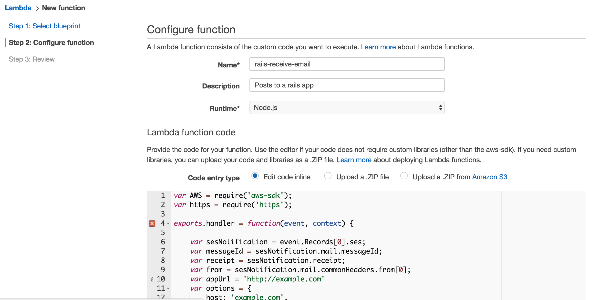
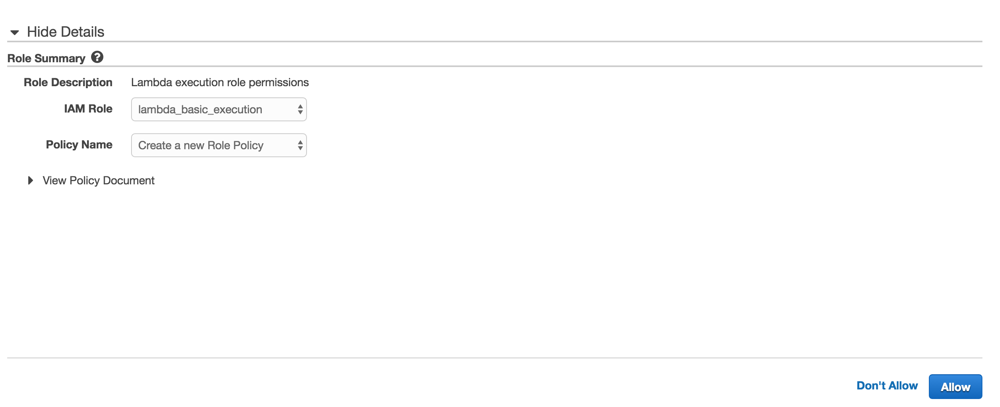
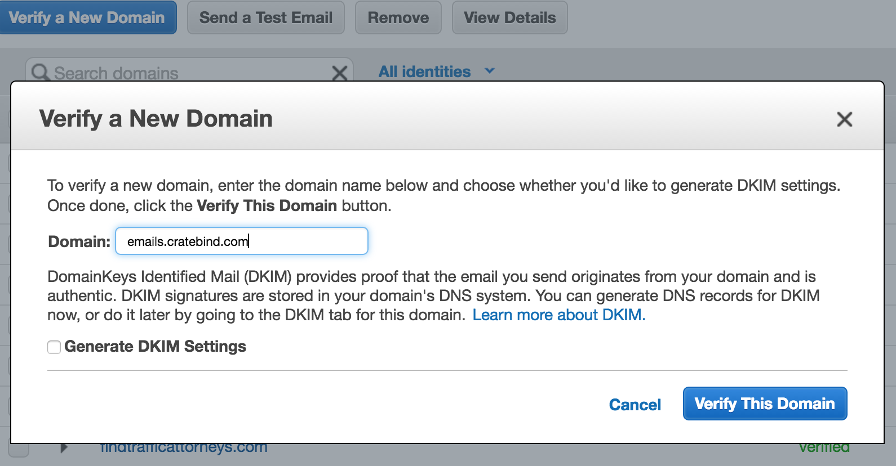
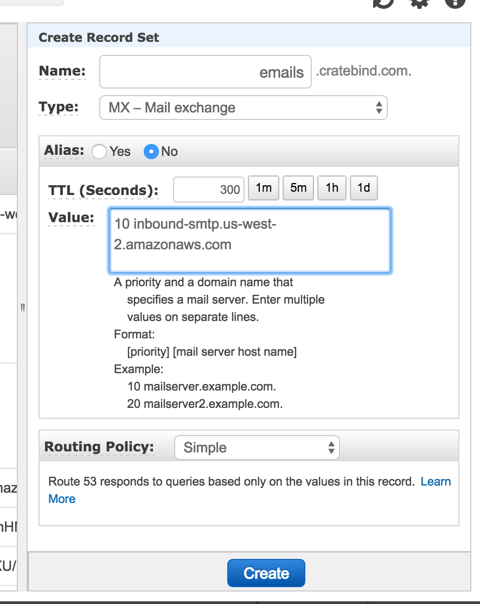
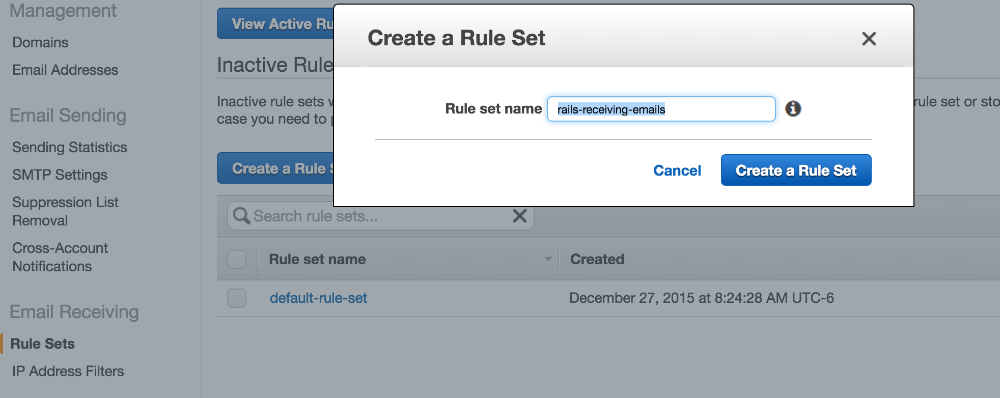
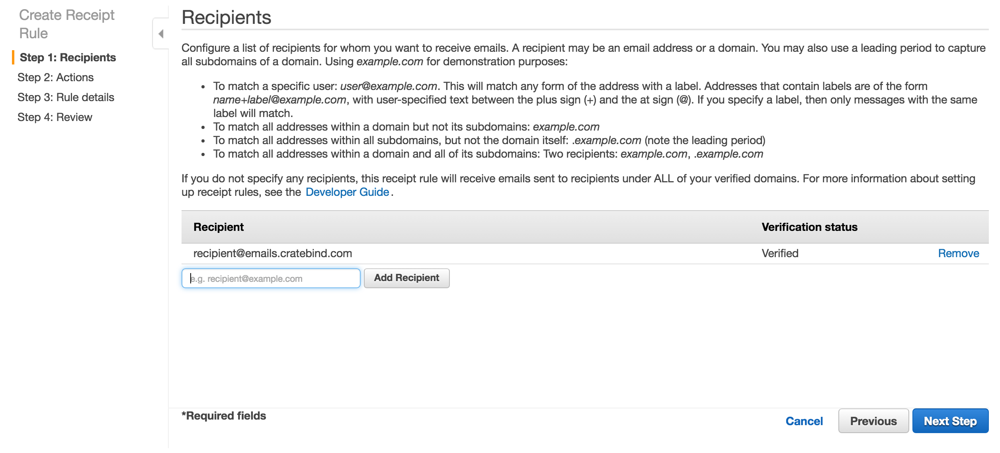
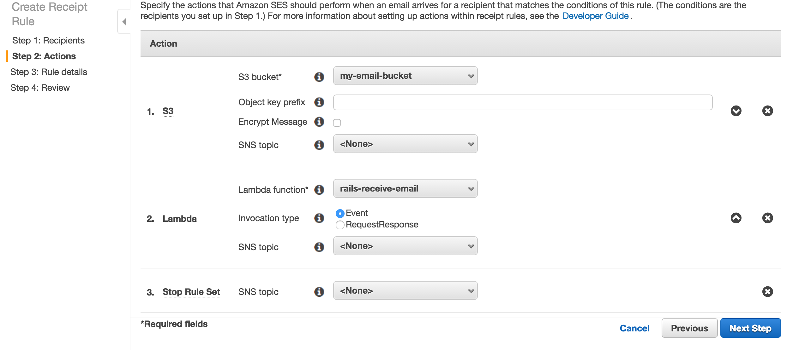

# Receive email from AWS Lambda & SES with Rails

Basic Rails app that demonstrates how to receive email from an AWS Lambda process.  Works for Rails apps where you want users to be able to send in emails.

## Setup AWS S3, Lambda, and SES
We will start with getting all the pieces in place in our AWS account for receiving emails, storing them in an S3 bucket, and setting up a Lambda function to post to our Rails app.

### S3 Bucket for SES to Store Emails
You will need to create a standard S3 bucket with a custom configuration for SES to store emails.

1. Create an S3 Bucket
2. Update the permissions rules with the following:
```
{
    "Version": "2008-10-17",
    "Statement": [
        {
            "Sid": "GiveSESPermissionToWriteEmail",
            "Effect": "Allow",
            "Principal": {
                "Service": [
                    "ses.amazonaws.com"
                ]
            },
            "Action": [
                "s3:PutObject"
            ],
            "Resource": "arn:aws:s3:::BUCKET-NAME/*",
            "Condition": {
                "StringEquals": {
                    "aws:Referer": "ACCOUNT-ID-WITHOUT-HYPHENS"
                }
            }
        }
    ]
}
```

### AWS Lambda function to process incoming mail

1. Click on Lambda from your AWS Console
2. Click Create New Function from the Lambda console
3. On the Select Blueprint screen, click Skip at the bottom right
4. Enter a name and description for your Lambda function and paste in the following code.  Replace the domain 'http://example.com' with the domain where you are deploying.
```
var AWS = require('aws-sdk');
var https = require('https');

exports.handler = function(event, context) {

    var sesNotification = event.Records[0].ses;
    var messageId = sesNotification.mail.messageId;
    var receipt = sesNotification.receipt;
    var from = sesNotification.mail.commonHeaders.from[0];
    var appUrl = 'https://www.example.com'
    var options = {
        host: 'www.example.com',
        port: 443,
        path: '/emails/incoming?token=test_token&message_id=' + messageId,
        method: 'POST',
        headers: {}
    };
    console.log('message ID', messageId);

    var req = https.request(options, function(res) {
        context.succeed();
        console.log('STATUS: ' + res.statusCode);
        res.on('data', function(chunk) {
            console.log('BODY: ' + chunk);
        });
    }).on('error', function(e) {
        console.log('FAILIRE: ' + e.message)
        context.done(null, 'FAILURE');
    });
    req.end();
}
```


5. For Role, just select basic execution role and a new tab will open inside your IAM console asking to create this new role.

6. (Optional) Choose a VPC for where to deploy the function
7. Click Create Function

You also have the option to save and test the function which will be helpful once you get your Rails app deployed to make sure everything is working in production.


### Setting up AWS SES to receive mail

Setup the domain for which you want to receive mail.  We typically use a subdomain so that it doesn't interfere with our normal company email @cratebind.com


   

Update your DNS record to point the subdomain MX records to SES.  The Value field depends on the AWS region in which your SES domain was setup.  For our account, we are using us-west-2 so our MX records would be as follows:


Lastly, you will create a new default rule in SES for how to process incoming messages.

1. Go to SES in your AWS Dashboard
2. Click on Rule Sets
3. Click Create Rule Set

4. Once you have created the Rule Set, now you need to create a Rule
5. In the create Rule screen, add the recipient.  You can read the instructions on this screen for how to setup a wilcard rule.  For our case, we will just create a recipient for recipient@emails.cratebind.com

6. Confgure the actions for the rule.  Here are the steps: (1) save email to S3, (2) trigger our AWS Lambda function and (3) Stop Processing.

7. You will need to update your specified S3 bucket with the following permission set in order for SES to be able to put the messages (instructions above)

Additional instructions on setting up SES to receive email if you get stuck [AWS SES Email Receiving Tutorial](http://docs.aws.amazon.com/ses/latest/DeveloperGuide/receiving-email-setting-up.html)

## Setup Your Rails App

### Generate model for receive emails
Create a basic model and controller that will receive the post response from AWS Lambda and save the email in the database.

```
rails g scaffold email from:string body:text to:string subject:string
```

### Model Method
We will use Webmock and stub data to test that we have the correct controller and model actions in place to process the data we receive from AWS Lambda.

Our basic setup will be for our AWS Lambda function to store the incoming message in our S3 bucket and then post the message id to our Rails app.  So we will first build a class method in our Email model that takes the message_id and pulls the email from the S3 bucket and saves it to our database

We have created a example message that represents the text file saved by AWS SES to S3 and we will write a test that stubs this message from the get request to our S3 bucket in spec/models/email_spec.rb

This is the Webmock setting to stub the request to S3:

```
#spec/rails_helper.rb
  config.before do
    WebMock.disable_net_connect!(allow_localhost: true)
    stub_request(:get, "https://my-email-bucket.s3-us-west-2.amazonaws.com/test")
      .to_return(status: 200, body: File.read('spec/support/lambda_email'))
  end
```

And this is the model method that we have built to handle the incoming messages:

```
  def self.process_incoming_email(message_id)
	s3 = Aws::S3::Client.new(region: 'us-west-2')
		obj = s3.get_object(bucket: 'keyman-emails', key: message_id)
		mail = Mail.new(obj.body.read)
		from, to = mail.from.join(', '), mail.to.join(', ')
		subject, body = mail.subject, mail.body.raw_source
		self.create(from: from, to: to, subject: subject, body: body)
  end 

```

### Controller Action
Next we will build a test to spec the controller action that receive the POST from AWS Lambda, validates the token and passes the message_id to the model method we just build and tested.

The controller action looks like this.  You obviously will want to create a different token than just 'test_token' and will want to set it as an ENV variable.

```
  ##
  # Receive the AWS post, validate the token and pass to our model method
  def incoming
    if params[:token] && (params[:token] == 'test_token')
      @email = Email.process_incoming_email(params[:message_id])
      if @email.valid?
        render text: 'email created', status: :created 
      else
        render text: @email.errors.full_messages, status: :unprocessable_entity
      end
    else
      render text: 'unauthorized', status: :unauthorized
    end    
  end
```

and the test like this:

```
  context 'receive a post from Lambda' do
    it 'should be receive a message from email via Lambda' do
      expect { post(:incoming, token: 'test_token', message_id: 'test') }.to change { Email.count }.by(1)
    end
    
    it 'should be be unauthorized without the lamda token' do
      response = post :incoming, message_id: 'test'
      expect(response.status).to eq(401)
    end
  end

```
